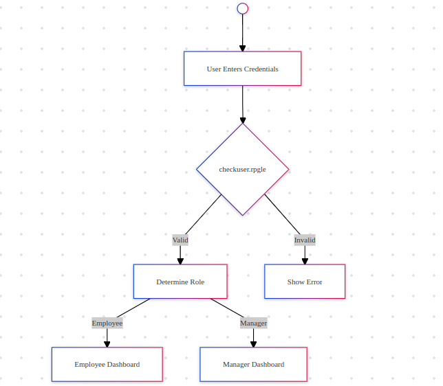

# Leave Management System

## Table of Contents
1. [Overview](#overview)
2. [System Architecture](#system-architecture)
3. [Project Structure](#project-structure)
4. [Interfaces](#interfaces)
5. [Database Design](#database-design)
6. [Development Guidelines](#development-guidelines)
7. [Deployment](#deployment)
8. [Testing](#testing)

## Overview

The Leave Management System is an IBM i (AS/400) based application designed to streamline employee leave requests and management. It provides separate interfaces for employees and managers, handling leave submissions, approvals, and balance tracking.

### Key Features
- User authentication and role-based access
- Employee leave request submission
- Manager approval workflow
- Real-time leave balance tracking
- Detailed reporting capabilities

## System Architecture

### Component Diagram

User Interface Layer:


levmngsysd.dspf  
       ▲  
       │  
       ▼  
Application Layer  
levmngsysr.rpgle ◄─► checkuser.rpgle  
       ▲  
       │  
       ▼  
Data Access Layer:

emplevedtl.pf, login.pf


### Workflow

### Core Components
- **levmngsysr.rpgle**: Main Program for Leave Mangement System
- **levmngsysd.dspf**: Display file for Leave Management System
- **checkuser.rpgle**: Authentication module
- **mngdashb.rpgle**: Module for Login Validation Manager
- **emplevedtl.pf**: Physical File for Leave Details
- **login.pf**: Physical File for Login Details

## Project Structure

```
qlvemngsys/
   ├── LEVMNGSYSR.RPGLE    # Main program
   ├── CHECKUSER.RPGLE     # User validation
   └── MNGDASHB.RPGLE      # Login Validation for Manager
   ├── LEVMNGSYSD.DSPF     # Display file
   ├── EMPLEVEDTL.PF       # Leave details file
   └── LOGIN.PF            # Login details file
   ├── COMPILER.CLLE       # Compilation utility
   └── DEBUGGER.CLLE       # Debug utility
   └── TASKS.TXT           # Case study document
```

## Interfaces

### Manager Dashboard


### Employee Dashboard


#### Features
- Employee details display
- Leave balance overview
- Update functionality (F6)
- Navigation options (F3=Exit, F12=Cancel)

#### Sample Code Structure
```
0006.00 **Free
0007.00    // ** Control Options    **                                                  230924 
0008.00                                                                                 230924 
0009.00       Ctl-Opt Option(*nodebugio:*Srcstmt)  ;                                    230924 
0010.00                                                                                 230924 
0011.00    // ** Desplay File Declaration                                               230924 
0012.00                                                                                 230924 
0013.00       Dcl-F LEVMNGSYSD Workstn Indds(PGMIND) ;                                  230926 
0014.00                                                                                 230924 
0015.00    // ** Physical File Declaration **                                           230924 
0016.00                                                                                 230924 
0017.00       Dcl-F EmpLevDtl Disk Usage(*Input:*Output:*Update) Keyed ; //TS02         230925 
0018.00                                                                                 230924 
0019.00    // ** Variables Declaration      **                           //TS01         230924 
```


## Database Design

### Physical Files

#### EMPLEVEDTL.PF
```
                R EMPLEVDTLR
                  E_EMPID        8A         COLHDG('EMPLOYEE ID')
                  E_LEVAVAIL     4S 0       COLHDG('LEAVES AVAILED')
                  E_ELBAL        4S 0       COLHDG('EL BALANCE')
                  E_CLBAL        4S 0       COLHDG('CL BALANCE')
                K E_EMPID
```

#### LOGIN.PF
```
     A          R LOGINR
     A            USERNAME       8A         COLHDG('USER NAME')
     A            PASSWORD       8S 0       COLHDG('PASSWORD')
     A            USERTYPE       1A         COLHDG('USER TYPE')
     A          K USERNAME
```

## Development Guidelines

### Naming Conventions
- Programs: Uppercase, 10 characters max
- Files: Uppercase, descriptive names
- Variables: Camel case, meaningful names


### Error Handling
- Use standard error handling routine
- Display user-friendly error messages

## Deployment

### Prerequisites
- IBM i OS Version: V7R3 or higher
- Authorities required:
  - QPGMR or QPGMR-like user profile
  - Read/Write access to own file QLVEMNGSYS

### Compilation Steps
1. Run COMPILER.CLLE
2. Verify object creation
3. Update production library

```
CALL COMPILER PARM('QLVEMNGSYS' 'SQUAD1')
```

## Testing

### Test Cases
1. Authentication
   - Valid login
   - Invalid login

2. Leave Management
   - Submit leave request
   - Balance calculation


## Contributing

1. Fork the repository
2. Create your feature branch
3. Commit your changes
4. Push to the branch
5. Create a new Pull Request

## License

This project is licensed under the MIT License - see the LICENSE.md file for details

---

## Contact

For support or queries, contact:
- Tech Ettaki El Mehdi
- Email: [el.ettaki22@gmail.com](mailto:placeholder@email.com)

Would you like me to:
1. Add more detailed information to any section?
2. Include actual code samples for specific functionality?
3. Add more diagrams or visual representations?