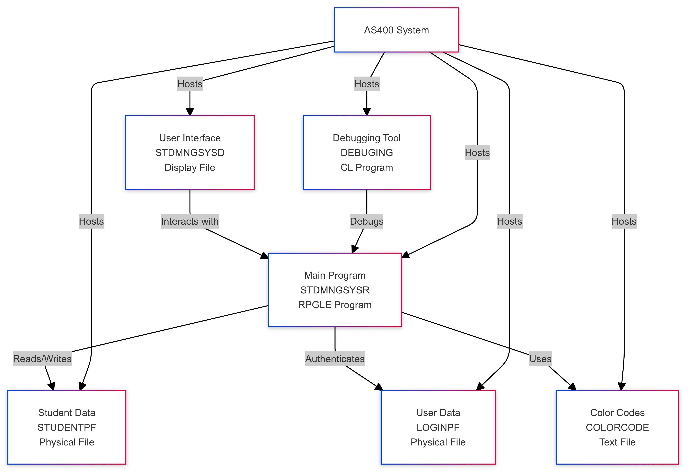
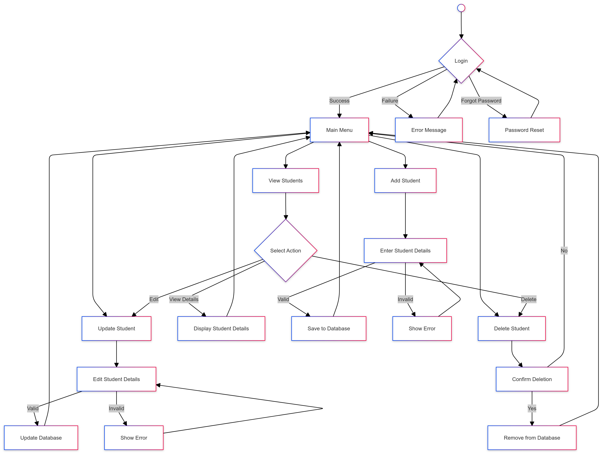

# Student Management System (AS400)

## Table of Contents
1. [Overview](#1-overview)
2. [System Architecture](#2-system-architecture)
3. [Project Structure](#3-project-structure)
4. [Interfaces](#4-interfaces)
5. [Database Design](#5-database-design)
6. [Development Guidelines](#6-development-guidelines)
7. [Deployment](#7-deployment)
8. [Testing](#8-testing)

## 1. Overview

The Student Management System is an AS400-based application designed to efficiently manage student records. It provides a user-friendly interface for administrators to perform various operations related to student data management, including user authentication, student registration, record updates, and deletions.

Key Features:
- User Authentication
- Student Registration
- Display Student Records
- Update Student Information
- Delete Student Records
- Password Recovery

## 2. System Architecture

The Student Management System is built on the AS400 platform, utilizing the following components:

- **Frontend**: Text-based user interface (5250 terminal emulation)
- **Backend**: RPG (Report Program Generator) programs
- **Database**: DB2 for i (integrated database for AS400)
- **Development Environment**: IBM Rational Developer for i (RDi) or equivalent AS400 development tools

The system follows a traditional mainframe architecture, with tight integration between the user interface, business logic, and database operations.

### Component Diagram

The following diagram illustrates the main components of the Student Management System and their interactions:

This diagram shows:
- The central role of the STDMNGSYSR RPGLE program in interacting with all other components.
- How the user interface (STDMNGSYSD) interacts with the main program.
- The main program's interaction with the database files (STUDENTPF and LOGINPF).
- The use of the COLORCODE file for UI styling and the DEBUGING program for troubleshooting.
- All components are hosted on the AS400 system.

### Workflow Diagram

The following diagram illustrates the main workflow of the Student Management System:

This workflow diagram illustrates:
- The user authentication process, including the password reset option.
- The main menu options: View, Add, Update, and Delete student records.
- The process flow for each operation, including data validation steps.
- Error handling and user feedback loops.
- How each operation eventually leads back to the main menu.

## 3. Project Structure

The project consists of the following main components:

- `COLORCODE` (TXT): Color code definitions for the user interface
- `DEBUGING` (CLLE): CL program for debugging the main RPG module
- `LOGINPF` (PF): Physical file storing user login information
- `STDMNGSYSD` (DSPF): Display file defining the user interface screens
- `STDMNGSYSR` (RPGLE): Main RPG program containing the business logic
- `STUDENTPF` (PF): Physical file storing student information

## 4. Interfaces

The system includes the following key interfaces:

1. Login Screen
2. Main Menu
3. Student Registration Form
4. Student List Screen
5. Student Detail Display
6. Update Student Information Screen
7. Delete Confirmation Screen
8. Forgot Password Screen

Each interface is defined in the STDMNGSYSD display file and controlled by the STDMNGSYSR RPGLE program.

## 6. Development Guidelines

- Use modular programming techniques in the STDMNGSYSR RPG program.
- Follow consistent naming conventions for variables, procedures, and files.
- Use the DEBUGING CL program for troubleshooting issues in STDMNGSYSR.
- Ensure all UI changes in STDMNGSYSD align with the color scheme defined in COLORCODE.
- Document all major procedures and any complex logic within the code.
- Regularly backup source code and database files.

## 7. Deployment

1. Ensure the AS400 environment is properly set up.
2. Compile the RPGLE (STDMNGSYSR) and CLLE (DEBUGING) programs.
3. Create the necessary physical files (LOGINPF and STUDENTPF) if they don't exist.
4. Bind the programs with the display file (STDMNGSYSD) and physical files.
5. Set up appropriate user permissions for accessing the system.
6. Perform a system backup before deploying any updates.

## 8. Testing

- Unit Testing: Test individual procedures within the STDMNGSYSR program.
- Integration Testing: Ensure proper interaction between the RPG program, display file, and physical files.
- System Testing: Perform end-to-end testing of all functionalities.
- User Acceptance Testing (UAT): Involve end-users to validate the system meets their requirements.
- Performance Testing: Assess system performance under various load conditions.

Test scenarios should cover:
- User authentication (valid and invalid credentials)
- Student registration (with valid and invalid data)
- Updating student information
- Deleting student records
- Password recovery process
- Error handling and validation checks

Regular testing should be performed after any significant changes to the system.